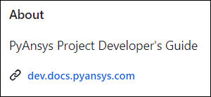
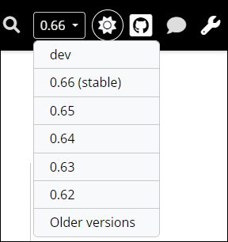

.. _essentials_writers:

Essentials for content writing
==============================

This page provides essential information for writing content for PyAnsys documentation.

These earlier topics are also related to documentation or contributing to a PyAnsys
library:

- :ref:`documenting_developers` provides an overview of key documentation concepts
  along with some how-to information.

- :ref:`doc_style_developers` provides valuable information about API documentation,
  Sphinx configuration, NumPy-style docstrings, documentation  generation, and tools
  for documentation style and coverage.

- :ref:`contributing` provides the general coding paradigms for PyAnsys development
  that you must understand before contributing to a PyAnsys library.

Google developer documentation style guide
------------------------------------------

All contributors to PyAnsys documentation must follow the guidelines in the
`Google developer documentation style guide <Google_dev_doc_style_guide_>`_.
While you should become familiar with this entire style guide, periodically revisit the
`Highlights <Google_dev_doc_highlights_>`_ page to ensure that you are adhering to its most important points.

When the `Ansys templates <Ansys_templates_>`_ tool is used to create a PyAnsys project from the
``pyansys`` or ``pyansys-advanced`` template, `Vale`_, a rule-based tool for maintaining
a consistent style and voice in your documentation, is implemented. This tool, which is one of
many run by the CI/CD process, is configured to check content in RST and Markdown (MD) files
based on the *Google developer documentation style guide*.

To eliminate or mitigate the number of warnings and errors that Vale raises in a PR, you can install
Vale locally and then run it before you create or submit changes to a PR. For more information,
see :ref:`install_Vale_locally` and :ref:`run_Vale_locally`.

PyAnsys documentation
---------------------

On the right of the home page for a PyAnsys library's GitHub repository, the **About** area
has a link to the library's documentation. For example, here is the **About** area
for this guide:

You can also view the documentation for public PyAnsys libraries from the
`PyAnsys <PyAnsys_>`_ landing page or from the Ansys Python Manager by
selecting **Help > PyAnsys Documentation**. For more information about this Python QA
app, see :ref:`Ansys_Python_Manager`.

All links to PyAnsys documentation take you to documentation for the stable (latest)
release because this is what users of the library generally want to see. In some cases,
users might want to see documentation for a legacy version of the library. Project contributors,
on the other hand, likely want to see the documentation for the development (main) branch of the
library.

Rather than hosting many separate documentation sites, the PyAnsys team supports enabling *multi-versions*,
which makes it possible for you to select the documentation for different versions from a dropdown button
on the right side of the documentation title bar.

This dropdown button provides for selecting the documentation for the stable version, development (dev)
version, and three previous legacy versions by default. However, the selections it displays
can be customized. For more information on enabling and customizing this
dropdown button, see :ref:`multi_version_enabling`.

To edit and contribute to the documentation for the development branch, you should select
 **dev** from this dropdown to view the documentation for the main branch.

.. tip::
    When you are viewing PyAnsys documentation, the right navigation pane typically
    displays **Show Source** and **Edit on GitHub** links. For information on using
    the **Show Source** link to see how a page's source file is formatted and how
    you can reuse this content, see :ref:`rst_file_formatting`. For information on
    using the **Edit on GitHub** link to use the GitHub web editor to submit
    suggested changes to a page in a PR, see :ref:`edit_on_GitHub`.
