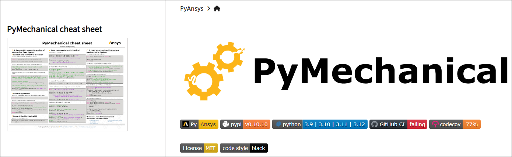

.. _show_cheat_sheet_thumbnail:

Show cheat sheet thumbnail
==========================

If a cheat sheet exists for a PyAnsys library, you can show a thumbnail of it in the
left navigation pane of one or more documentation pages. For example, this image
shows a cheat sheet thumbnail on the landing page of the PyMechanical documentation:

To show a thumbnail, you add a child ``cheatsheet`` dictionary to the Sphinx
configuration (``conf.py``) file in the ``doc`` directory as described in
`Cheat Sheets <https://sphinxdocs.ansys.com/version/stable/user-guide/options.html#cheat-sheets>`_
in the Ansys Sphinx Theme documentation.
