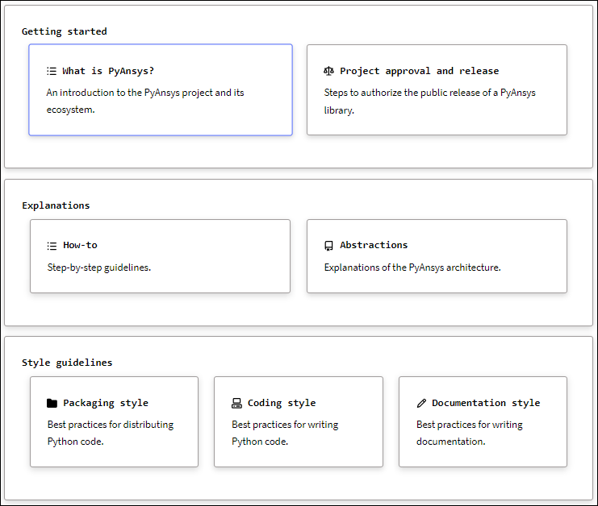
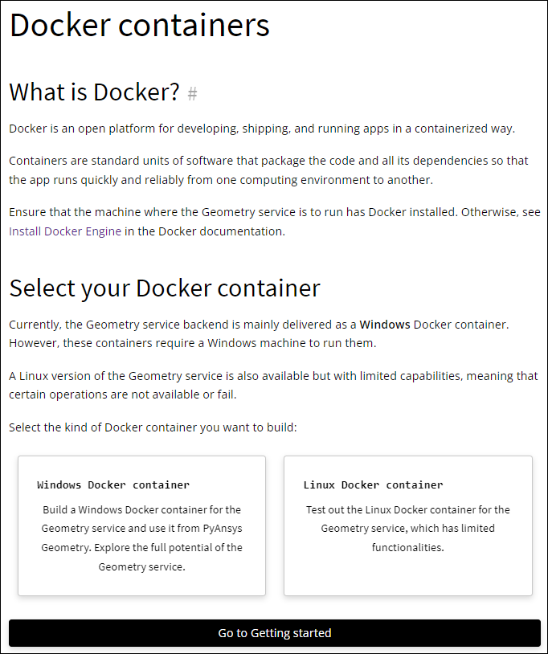

.. _cards:

Cards
=====

Cards are special content blocks or components that visually stand out from
regular text. You use cards to emphasize or showcase specific pieces of
information. While :ref:`notices <notices>` are simple cards that you use
admonition directives to create, you can manually create more sophisticated
custom cards.

.. note::
   To use custom cards in your PyAnsys documentation, you must install
   the `sphinx-design <Sphinx_ext_sphinx_design_>`_ extension and then
   add it to the ``conf.py`` file in the ``doc/source`` directory and to
   your list of documentation requirements. For more information, see
   :ref:`add_sphinx_extensions`.

   To see and use the cards that are shown only as images on this page,
   click the links to their respective documentation pages. To see how these
   cards are formatted, click the **Show Source** link in the documentation page's
   right pane. As described in :ref:`rst_file_formatting`, you can copy content
   from the TXT version of this file and then paste it directly into one of your
   RST files for reuse, modifying it as needed.

Here is an image of the cards on the documentation landing page for this guide.
These cards describe and link to various sections of this guide.

Here is an image of cards on the `Docker containers <PyAnsys_geometry_Docker_containers_>`_
page in the PyAnsys Geometry documentation. These cards link to instructions for building
either a Windows Docker container or a Linux Docker container for the Ansys Geometry service.
You only need to click the card for your operating system. This page and the other pages
in the PyAnsys Geometry **Getting Started** section also have a **Go to Getting started**
button for returning to this section's first page.

