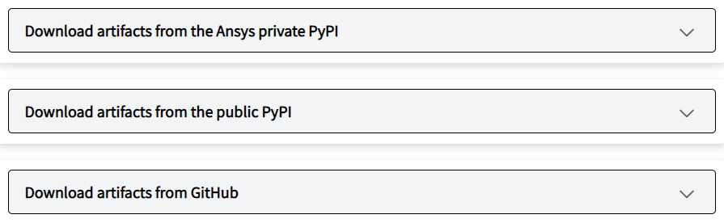

.. _collapsible_sections:

Collapsible sections
====================

When information is applicable only to a subset of your users or provides
more comprehensive information than most users need, you can use collapsible
sections. Then, only users who either need or want to view this information
can expand these sections.

.. note::
   To use collapsible sections in your PyAnsys documentation, you must install
   the ``sphinx_toolbox.collapse`` extension and then add it to the ``conf.py``
   file in the ``doc/source`` directory and to your list of documentation requirements.
   For more information, see :ref:`add_sphinx_extensions`.

   To see and use the collapsible sections that are shown only as an image.s on this page,
   see :ref:`app_and_services_logging`. To see how the collapsible sections on this
   page are formatted, click the **Show Source** link in the page's right pane.
   As described in :ref:`rst_file_formatting`, you can copy content from the
   TXT version of this file and then paste it directly into one of your RST files
   for reuse, modifying it as needed.

Here is an image of two collapsible sections. Clicking a collapsible section expands it
so that additional information is shown.

