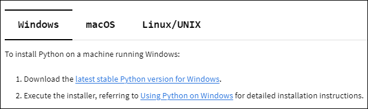
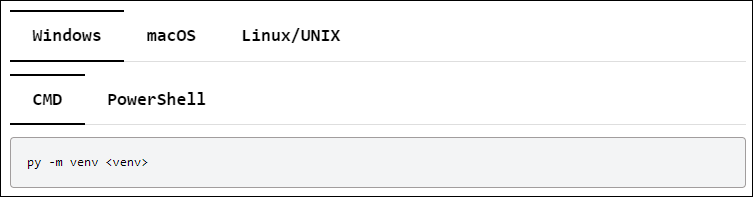

.. _tab_sets:

Tab sets
========

Tab sets are like cards in that they provide for quickly accessing
information that you are specifically interested in. In PyAnsys
documentation, tab sets are often used to provide procedures or commands
for different operating systems.

.. note::
   To use tab sets in your PyAnsys documentation, you must install
   the `sphinx-design <Sphinx_ext_sphinx_design_>`_ extension and then add
   it to the ``conf.py`` file in the ``doc/source`` directory and to your
   list of documentation requirements. For more information, see
   :ref:`add_sphinx_extensions`.

   To see and use the tab sets that are shown only as images on this page,
   see :ref:`setting_up_dev_environment`. To see how the tab sets on this
   page are formatted, click the **Show Source** link in the page's right pane.
   As described in :ref:`rst_file_formatting`, you can copy content from the
   TXT version of this file and then paste it directly into one of your RST files
   for reuse, modifying it as needed.

Here is an image of a tab set with tabs for installing Python on machines running different
operating systems. When you click a tab, the procedure for the selected operating system
is shown.

Here is an image of a tab set with two rows. In the top row, you click the tab for your operating
system. In the bottom row, you click the tab for the shell that you want to run the
command in (if more than one shell is available). You can then copy this command and
paste it in the shell's command line.

