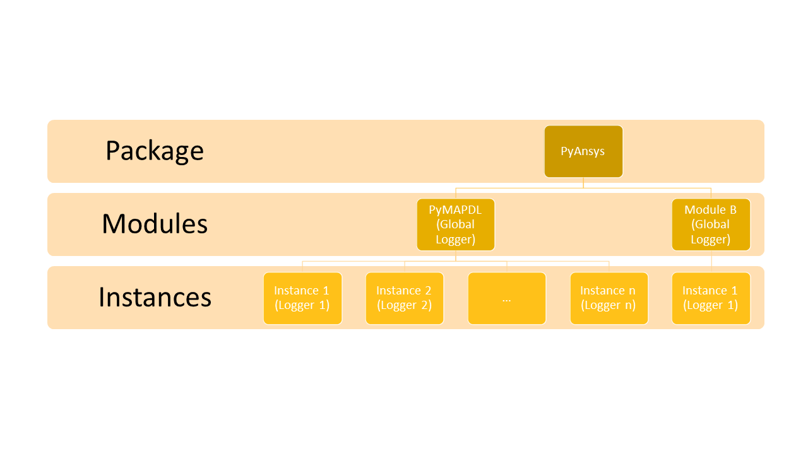

Logging Guidelines
##################

This section describes several guidelines for logging in PyAnsys
libraries. These guidelines are best practices discovered through
implementing logging services and modules within PyAnsys
libraries. Suggestions and improvements are welcome.

Why and when to log
===================
Logging helps to track events occurring in the application.
Whenever an information must be exposed, displayed and shared, logging is the
way to do it.
It is destinated to both the users and the application developers.
It can serve several purposes:

  - extract some valuable data for the final users to know the status of their work.
  - track the progress and the course of the application usage.
  - provide the developer with as much information as possible if an issue happens.

The message logged can contain generic information or embed data specific
to the current session.
Message content is associated to a level of severity (info, warning, error...).
Generally, this degree of significance indicates the recipient of the message.
An info message is directed to the user while a debug message is useful for
the developer itself.

Logging in PyAnsys Libraries
============================

The logging capabilities in PyAnsys libraries should be built upon the
`standard logging <https://docs.python.org/3/library/logging.html/>`__
library.  PyAnsys libries should not to replace this library, rather provide
a standardized way to interact between the built-in :mod:`logging`
library and ``PyAnsys`` libraries.

Application or Service Logging
~~~~~~~~~~~~~~~~~~~~~~~~~~~~~~
The following guidelines describe "Application" or "Service" logging
module for a PyAnsys library, where a PyAnsys library is used to
extend or expose features from an Ansys application, product, or
service that may be local or remote.

This section describes two two main loggers for a PyAnsys library that
exposes or extends a service based application, the *Global logger*
and the *Instance logger*. These loggers are customized classes that wrap
:class:`logging.Logger` from :mod:`logging` module and add specific
features to it.  :ref:`logging_in_pymapdl_figure` outlines the logging
approach used by PyMAPDL and the scopes of the global and local
loggers.

.. _logging_in_pymapdl_figure:

    **Figure 1: Example Logging Structure in PyMAPDL**

The source for this example logger can be found both within developers
guide repository at `pyansys_logging.py
<https://github.com/pyansys/dev-guide/blob/main/logging/pyansys_logging.py>`_
as well as below in the collapsable section below:

.. collapse:: Example PyAnsys custom logger module

    .. literalinclude:: ../../../logging/pyansys_logging.py

Example Global logger
~~~~~~~~~~~~~~~~~~~~~

There is a global logger named ``py*_global`` which is created when
importing ``ansys.product.service``
(``ansys.product.service.__init__``).  This logger is recommended for
most scenarios, especially when complex modules or classes are not
involved, since it does not track instances, rather can be used
globally.  If you intend to log the initialization of a library or
module, you should use this logger.  To use this global logger, you
must import it at the top of your script or module:

.. code:: python

   from ansys.product.service import LOG

You could also rename it to avoid conflicts with other loggers (if any):

.. code:: python

   from ansys.product.service import LOG as logger

It should be noted that the default logging level of ``LOG`` is
``ERROR`` (``logging.ERROR``).  To change this and output different
ferror level messages you can use the next approach:

.. code:: python

   LOG.logger.setLevel('DEBUG')
   LOG.file_handler.setLevel('DEBUG')  # if present
   LOG.stdout_handler.setLevel('DEBUG')  # if present

Alternatively, you can use:

.. code:: python

   LOG.setLevel('DEBUG')

This way ensures all the handlers are set to the desired log level.

By default, this logger does not log to a file. If you wish to do so,
you can add a file handler using:

.. code:: python

   import os
   file_path = os.path.join(os.getcwd(), 'pylibrary.log')
   LOG.log_to_file(file_path)

This enables logging to that file in addition of the standard output.
If you wish to change the characteristics of this global logger from
the beginning of the execution, you must edit the file ``__init__`` in
the directory of your library.

To log using this logger, simply call the desired method as a normal
logger.

.. code:: python

    >>> import logging
    >>> from ansys.mapdl.core.logging import Logger
    >>> LOG = Logger(level=logging.DEBUG, to_file=False, to_stdout=True)
    >>> LOG.debug('This is LOG debug message.')
    | Level    | Instance        | Module           | Function             | Message
    |----------|-----------------|------------------|----------------------|--------------------------------------------------------
    | DEBUG    |                 |  __init__        | <module>             | This is LOG debug message.

Instance logger
~~~~~~~~~~~~~~~
Every time that the class ``_MapdlCore`` is instantiated, a logger is
created.  This logger is recommended when using the ``pool`` library
or when using multiple instances of ``Mapdl``.  The main feature of
this logger is that it tracks each instance and it includes its name
when logging.  The name of the instances are unique.  For example in
case of using the ``gRPC`` ``Mapdl`` version, its name includes the IP
and port of the correspondent instance, making unique its logger.

The instance loggers can be accessed in two places:

* ``_MapdlCore._log``. For backward compatibility.
* ``LOG._instances``. This field is a ``dict`` where the key is the
  name of the created logger.

These instance loggers inherit from the ``pymapdl_global`` output
handlers and logging level unless otherwise specified.  The way this
logger works is very similar to the global logger.  You can add a file
handler if you wish using the method ``log_to_file`` or change the log
level using :meth:`logging.Logger.setLevel`.

You can use this logger like this:

.. code:: python
    
    >>> from ansys.mapdl.core import launch_mapdl
    >>> mapdl = launch_mapdl()
    >>> mapdl._log.info('This is an useful message')

    | Level    | Instance        | Module           | Function             | Message
    |----------|-----------------|------------------|----------------------|--------------------------------------------------------
    | INFO     | 127.0.0.1:50052 |  test            | <module>             | This is an useful message

Other loggers
~~~~~~~~~~~~~~~~~
You can create your own loggers using python ``logging`` library as you would do in any other script.
There shall be no conflicts between these.

For instance, if an ANSYS product is using a custom logger encapsulated inside the product itself, you might benefit from exposing it through the standard python tools.
It is recommended to use the standard library as much as possible. It will benefit every contributor to your project by exposing common tools that are widely spread. Each developer will be able to operate quickly and autonomously.
Your project will take advantage of the entire set of features exposed in the standard logger and all the upcoming improvements.

Create a custom log handler to catch each product message and redirect them on another logger:
==============================================================================================

Context:
~~~~~~~~~

AEDT product has its own internal logger called the message manager made of 3 main destinations: 

  * *Global*: for the entire Project manager
  * *Project*: related to the project
  * *Design*: related to the design (most specific destination of each 3 loggers.)

The message manager is not using the standard python logging module and this might be a problem later when exporting messages and data from each ANSYS product to a common tool. In most of the cases, it is easier to work with the standard python module to extract data.
In order to overcome this limitation, the existing message manager is wrapped into a logger based on the standard python `logging <https://docs.python.org/3/library/logging.html>`__ module.

.. figure:: images/log_flow.png
    :align: center
    :alt: Loggers message passing flow.
    :figclass: align-center

    **Figure 1: Loggers message passing flow.**

To do so, we created a class called LogHandler based on logging.Handler.
The initializer of this class will require the message manager to be passed as an argument in order to link the standard logging service with the ANSYS internal message manager.

.. code:: python

    class LogHandler(logging.Handler):

        def __init__(self, internal_app_messenger, log_destination, level=logging.INFO):
            logging.Handler.__init__(self, level)
            # destination is used if your internal message manager
            # is made of several different logs. Otherwise it is not relevant.
            self.destination = log_destination
            self.messenger = internal_app_messenger

        def emit(self, record):
            pass

The purpose of this class is to send log messages in AEDT logging stream.
One of the mandatory actions is to overwrite the ``emit`` function. This method operates as a proxy. It will dispatch all the log message toward the message manager.
Based on the record level, the message is sent to the appropriate log level (debug, info, error...) into the message manager to fit the level provided by the ANSYS product.
As a reminder the record is an object containing all kind of information related to the event logged.

This custom handler is used into the new logger instance (the one based on the standard library).
A good practice before to add a handler on any logger is to verify if any appropriate handler is already available in order to avoid any conflict, message duplication...

App Filter
~~~~~~~~~~
In case you need to modify the content of some messages you can apply filters. This can be useful to harmonize the message rendering especially when you write in an external file. To do so you can create a class based on the logging.Filter.
You must implement the ``filter`` method. It will contain all the modified content send to the stream.

.. code:: python

    class AppFilter(logging.Filter):

        def __init__(self, destination="Global", extra=""):
            self._destination = destination
            self._extra = extra

        def filter(self, record):
            """Modify the record sent to the stream.""""

            record.destination = self._destination

            # This will avoid the extra '::' for Global that does not have any extra info.
            if not self._extra:
                record.extra = self._extra
            else:
                record.extra = self._extra + ":"
            return True

Avoid printing to the console
~~~~~~~~~~~~~~~~~~~~~~~~~~~~~~~
A common habit while prototyping a new feature is to print message into the command line executable.
Instead of using the common ``Print()`` method, it is advised to use a ``StreamHandler`` and redirect its content.
Indeed that will allow to filter messages based on their level and apply properly the formatter.
To do so, a boolean argument can be added in the initializer of the ``Logger`` class. This argument specifies how to handle the stream.

.. code:: python

    class CustomLogger(object):

        def __init__(self, messenger, level=logging.DEBUG, to_stdout=False):

            if to_stdout:
                self._std_out_handler = logging.StreamHandler()
                self._std_out_handler.setLevel(level)
                self._std_out_handler.setFormatter(FORMATTER)
                self.global_logger.addHandler(self._std_out_handler)

Formatting
~~~~~~~~~~
Even if the current practice recommends using the f-string to format
your strings, when it comes to logging, the former %-formatting is
preferable.  This way the string format is not evaluated at
runtime. It is deferred and evaluated only when the message is
emitted. If there is any formatting or evaluation error, these will be
reported as logging errors and will not halt code execution.

.. code:: python

    logger.info("Project %s has been opened.", project.GetName())

Enable/Disable handlers
~~~~~~~~~~~~~~~~~~~~~~~
Sometimes the user might want to disable specific handlers such as a
file handler where log messages are written.  If so, the existing
handler must be properly closed and removed. Otherwise the file access
might be denied later when you try to write new log content.

Here's one approach to closing log handlers.

.. code:: python

    for handler in design_logger.handlers:
        if isinstance(handler, logging.FileHandler):
            handler.close()
            design_logger.removeHandler(handler)
