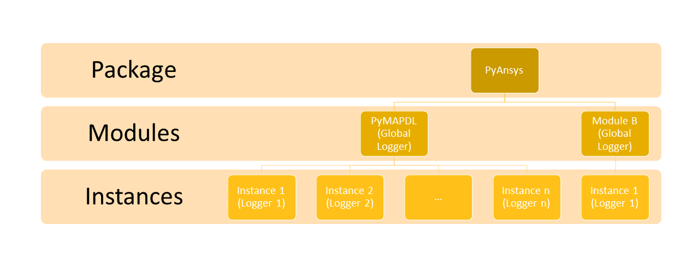

Logging
=======
This section provides guidelines for logging in PyAnsys libraries. These
guidelines are best practices discovered through implementing logging services
and modules within PyAnsys libraries. Suggestions and improvements are welcomed.

Visit the `Official Python Logging Tutorial
<https://docs.python.org/es/3/howto/logging.html>`_ for logging techniques. In
particular, see:

- `Python Basic Logging Tutorial <https://docs.python.org/3/howto/logging.html#basic-logging-tutorial>`_
- `Python Advanced Logging Tutorial <https://docs.python.org/3/howto/logging.html#basic-logging-tutorial>`_

Description and usage
---------------------
Logging helps to track events occurring in the app. A log record is 
created for each event. This record contains detailed information about the
current app operation. Whenever information must be exposed, displayed,
and shared, logging is the way to do it.

Logging is beneficial to both users and app developers. It serves several
purposes:

- Extracts some valuable data for the final users to know the status of their work
- Tracks the progress and the course of the app usage
- Provides the developer with as much information as possible if an issue happens
  
The message logged can contain generic information or embed data specific to the
current session. Message content is associated to a severity level, such as info,
warning, and error. Generally, the severity level indicates the recipient of the message.
For example, an info message is directed to the user, while a debug message is directed
to the developer.

Logging best practices
----------------------
The logging capabilities in PyAnsys libraries should be built upon the `standard
logging <https://docs.python.org/3/library/logging.html>`__ library. A PyAnsys
library should not replace the standard logging library but rather provide a
standardized way for the built-in :mod:`logging` library and the PyAnsys library
to interact. Subsequent sections provide some best practices.

Avoiding printing to the console
~~~~~~~~~~~~~~~~~~~~~~~~~~~~~~~~
A common habit while prototyping a new feature is to print a message into the
command line executable. Instead of using the common `print
<https://github.com/pyansys/pyansys-tools-report>`_ method, you should use a
`stream handler
<https://docs.python.org/3/library/logging.handlers.html#logging.StreamHandler>`_
and redirect its content. This allows messages to be filtered based on
their severity level and apply formatting properly. To accomplish this, add a
Boolean argument in the initializer of the `Logger
<https://docs.python.org/3/library/logging.html#logging.Logger>`_ class that
specifies how to handle the stream.

Turning on and off handlers
~~~~~~~~~~~~~~~~~~~~~~~~~~~
You might sometimes want to turn off a specific handler, such as a file
handler where log messages are written. If so, you must property close 
and remove the existing handler. Otherwise, you might be denied file access
later when you try to write new log content.

Here is an example of how to close a log handler:

.. code-block:: python

    for handler in design_logger.handlers:
        if isinstance(handler, logging.FileHandler):
            handler.close()
            design_logger.removeHandler(handler)

Using app filters
~~~~~~~~~~~~~~~~~
An app filter shows all its value when the content of a message depends on some
conditions. It injects contextual information in the core of the message.
This can be used to harmonize message rendering when the app output varies
based on the data processed.

Using an app filter requires the creation of a class based on the
`logging filter <https://docs.python.org/3/library/logging.html#filter-objects>`_ and the
implementation of the `filter
<https://docs.python.org/3/library/logging.html#logging.Filter.filter>`_ method.
This method contains all modified content to send to the stream:

.. code:: python

    class AppFilter(logging.Filter):
        def __init__(self, destination=None, extra=None):
            if not destination:
                self._destination = "Global"
            if not extra:
                self._extra = ""

        def filter(self, record):
            """Modify the record sent to the stream.

            Parameters
            ----------
            record :

            """

            record.destination = self._destination

            # This will avoid the extra '::' for Global that does not have any extra info.
            if not self._extra:
                record.extra = self._extra
            else:
                record.extra = self._extra + ":"
            return True

.. code:: python

    class CustomLogger(object):
        def __init__(self, messenger, level=logging.DEBUG, to_stdout=False):

            if to_stdout:
                self._std_out_handler = logging.StreamHandler()
                self._std_out_handler.setLevel(level)
                self._std_out_handler.setFormatter(FORMATTER)
                self.global_logger.addHandler(self._std_out_handler)

Use %-formatting for strings
~~~~~~~~~~~~~~~~~~~~~~~~~~~~
Although using the f-string for formatting most strings is often recommended,
when it comes to logging, using the former %-formatting is preferable.
When %-formatting is used, the string is not evaluated at runtime. Instead, it
is evaluated only when the message is emitted. If any formatting or evaluation
errors occur, they are reported as logging errors and do not halt code.

.. code:: python

    logger.info("Project %s has been opened.", project.GetName())

App and service logging modules
---------------------------------------
PyAnsys libraries use app and Service logging modules to extend
or expose features from an Ansys app, product, or service, which can
be local or remote.

There are two main loggers for a PyAnsys library that expose or
extend a service-based app:

- Global logger
- Instance logger

These loggers are customized classes that wrap the :class:`logging.Logger`
class from the :mod:`logging` module and add specific features to it. This
image shows the logging approach used by PyMAPDL and the scopes
of the global and instance loggers.

.. _logging_in_pymapdl_figure:

You can find the source for this example logger in the collapsible section below
and in the ``dev_guide`` repository at `pyansys_logging.py
<https://github.com/pyansys/dev-guide/blob/main/logging/pyansys_logging.py>`_.

.. collapse:: Example PyAnsys Custom Logger Module

    .. literalinclude:: code/pyansys_logging.py

Some unit tests demonstrating how to use the PyAnsys custom logger module implemented 
in the preceding code are shown in this collapsible section:

.. collapse:: How to Use the PyAnsys Custom Logger Module

    .. literalinclude:: code/test_pyansys_logging.py

Global logger
-------------

A global logger named ``py*_global`` is created when importing
``ansys.product.service`` (``ansys.product.service.__init__``). This logger
does not track instances but rather is used globally. Consequently, using
it is recommended for most scenarios, especially those where simple modules
or classes are involved.

For example, if you intend to log the initialization of a library or module,
import the global logger at the top of your script or module:

.. code:: python

   from ansys.product.service import LOG

If the default name of the global logger is in conflict with the name of
another logger, you can rename it with:

.. code:: python

   from ansys.product.service import LOG as logger

The default logging level of the global logger is ``ERROR`` (``logging.ERROR``).
You can change the output to a different error level with:

.. code:: python

   LOG.logger.setLevel("DEBUG")
   LOG.file_handler.setLevel("DEBUG")  # if present
   LOG.stdout_handler.setLevel("DEBUG")  # if present

Alternatively, you can use this approach to ensure that all
handlers are set to the desired log level:

.. code:: python

   LOG.setLevel("DEBUG")

By default, the global logger does not log to a file. However, you can
enable logging to both a file and the standard output by adding
a file handler:

.. code:: python

   import os

   file_path = os.path.join(os.getcwd(), "pylibrary.log")
   LOG.log_to_file(file_path)

If you want to change the characteristics of the global logger from the beginning of
the execution, you must edit the file ``__init__`` in the directory of your
library.

To log using the global logger, simply call the desired method as a normal logger:

.. code:: pycon

    >>> import logging
    >>> from ansys.mapdl.core.logging import Logger
    >>> LOG = Logger(level=logging.DEBUG, to_file=False, to_stdout=True)
    >>> LOG.debug("This is LOG debug message.")

    | Level    | Instance        | Module           | Function             | Message
    |----------|-----------------|------------------|----------------------|--------------------------------------------------------
    | DEBUG    |                 |  __init__        | <module>             | This is LOG debug message.

Instance logger
---------------
An instance logger is created every time that the class ``_MapdlCore`` is
instantiated. Using this instance logger is recommended when using the ``pool``
library or when using multiple instances of ``Mapdl``. The main feature of the instance
logger is that it tracks each instance and includes the instance name when logging.
The names of instances are unique. For example, when using the ``gRPC`` ``Mapdl``
version, the instance name includes the IP and port of the corresponding instance,
making the logger unique.

You can access instance loggers in two places:

* ``_MapdlCore._log`` for backward compatibility
* ``LOG._instances``, which is a field of the ``dict`` data type with a key that
  is the name of the created logger.

These instance loggers inherit from the ``pymapdl_global`` output handlers and
logging level unless otherwise specified. An instance logger works similarly to
the global logger. If you want to add a file handler, use the method
``log_to_file``. If you want to change the log level, use the method
:meth:`logging.Logger.setLevel`.

Here is an example of how to use an instance logger:

.. code:: pycon
    
    >>> from ansys.mapdl.core import launch_mapdl
    >>> mapdl = launch_mapdl()
    >>> mapdl._log.info("This is an useful message")

    | Level    | Instance        | Module           | Function             | Message
    |----------|-----------------|------------------|----------------------|--------------------------------------------------------
    | INFO     | 127.0.0.1:50052 |  test            | <module>             | This is an useful message

Ansys product loggers
---------------------
An Ansys product, due to its architecture, can have several loggers. The
``logging`` library features support working with a finite number of loggers. The
factory function ``logging.getLogger()`` helps to access each logger by its name. In
addition to name mappings, a hierarchy can be established to structure the
loggers' parenting and their connections.

For example, if an Ansys product is using a pre-existing custom logger
encapsulated inside the product itself, the *<PyProject>* benefits from
exposing it through the standard Python tools. You should use the
standard library as much as possible. It facilitates every contribution
to the *<PyProject>*, both external and internal, by exposing common tools that
are widely adopted. Each developer is able to operate quickly and
autonomously. The project takes advantage of the entire set of features exposed
in the standard logger and all the upcoming improvements.

Custom log handlers
-------------------
You might need to catch Ansys product messages and redirect them to another
logger. For example, Ansys Electronics Desktop (AEDT) has its own internal
logger called the *message manager*, which has three main destinations: 

- *Global*, which is for the entire project manager
- *Project*, which is related to the project
- *Design*, which is related to the design, making it the most specific
   destination of the three loggers

The message manager does not use the standard Python logging module, which
can be a problem when exporting messages and data from it to a common tool.
In most cases, it is easier to work with the standard Python module to extract
data. To overcome this AEDT limitation, you must wrap the existing message
manager into a logger based on the standard Python :mod:`logging` module:

.. figure:: images/log_flow.png
    :align: center
    :alt: Loggers message passing flow.
    :figclass: align-center

The wrapper implementation is essentially a custom handler based on a
class inherited from ``logging.Handler``. The initializer of this class
requires the message manager to be passed as an argument to link the standard
logging service with the AEDT message manager.

.. code:: python

    class LogHandler(logging.Handler):
        def __init__(self, internal_app_messenger, log_destination, level=logging.INFO):
            logging.Handler.__init__(self, level)
            # destination is used if when the internal message manager
            # is made of several different logs. Otherwise it is not relevant.
            self.destination = log_destination
            self.messenger = internal_app_messenger

        def emit(self, record):
            pass

The purpose of this class is to send log messages in the AEDT logging stream.
One of the mandatory actions is to overwrite the ``emit`` function. This method
operates as a proxy, dispatching all log messages to the message manager.
Based on the record level, the message is sent to the appropriate log level, such
as debug, info, or error, into the message manager to fit the level provided by
the Ansys product. As a reminder, the record is an object containing all kind of
information related to the event logged.

This custom handler is use in the new logger instance (the one based on the
standard library). To avoid any conflict or message duplication, before adding
a handler on any logger, verify if an appropriate handler is already available.
