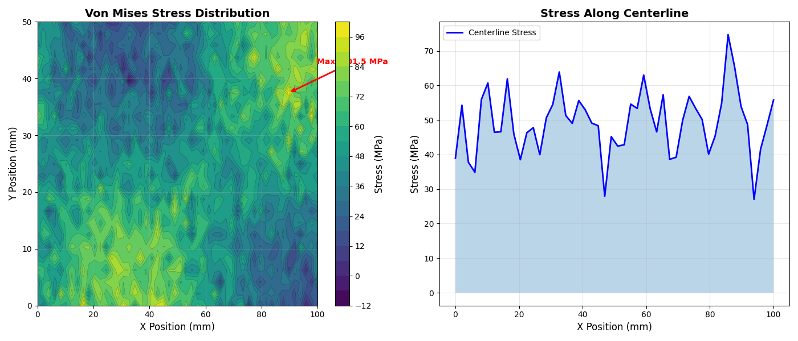
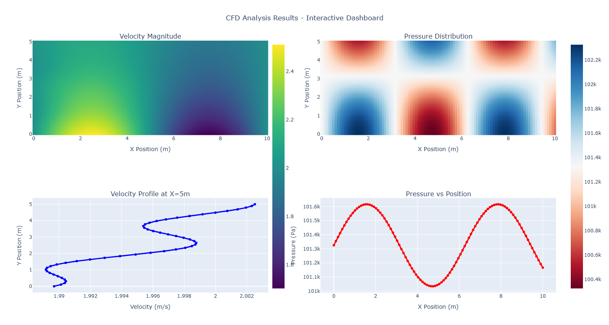
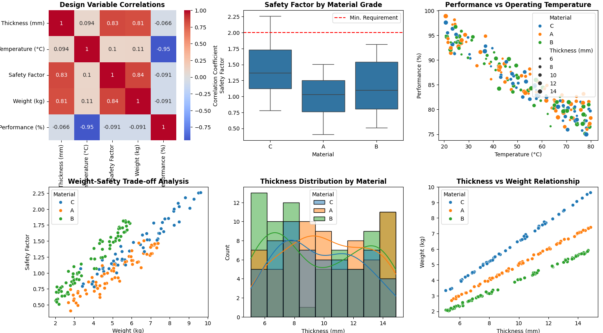

.. meta::
   :author: PyAnsys Core Team
   :date: 2025-10-01
   :categories: Tutorial, Visualization, PyAnsys
   :tags: python, plotting, 2d-graphics, pyansys, matplotlib, plotly, seaborn
   :industries: Engineering, Simulation
   :products: PyAnsys
   :image: thumbnails/pyansys-common.png
   :title: Presenting 2D data results with Python - A PyAnsys perspective
   :description: Learn how to effectively present engineering simulation data and results
                 using Python's 2D plotting libraries with practical PyAnsys examples.
                 From Matplotlib basics to interactive Plotly visualizations.

Presenting 2D data results with Python - a PyAnsys perspective
##############################################################

In engineering simulation and analysis, the ability to effectively present your results is as
crucial as generating them. Python's rich ecosystem of 2D plotting libraries provides powerful
tools for transforming raw simulation data into compelling visual insights that communicate
your findings clearly to stakeholders, colleagues, and decision-makers.

This article explores how to leverage Python's most effective 2D graphics libraries to present
engineering data results, with practical examples drawn from the PyAnsys ecosystem. Whether
you're visualizing structural analysis results, fluid dynamics data, or electromagnetic field
distributions, these tools will help you create professional, publication-ready graphics.

Matplotlib - The engineering standard for 2D plotting
=====================================================

Matplotlib remains the gold standard for engineering visualization in Python. Its precise
control over every plot element makes it ideal for creating publication-ready figures that
meet the rigorous standards expected in engineering documentation and research papers.

**PyAnsys example: Structural analysis results**

Let's visualize stress distribution results from a PyMAPDL structural analysis:

.. code-block:: python

   import matplotlib.pyplot as plt
   import numpy as np

   # Example: Visualizing stress results from PyMAPDL
   # (Simulated data for demonstration)
   
   # Node coordinates and stress values
   x_coords = np.linspace(0, 100, 50)  # mm
   y_coords = np.linspace(0, 50, 25)   # mm
   X, Y = np.meshgrid(x_coords, y_coords)
   
   # Simulated von Mises stress distribution (MPa)
   stress = 50 + 30 * np.sin(X/20) * np.cos(Y/15) + 10 * np.random.randn(*X.shape)
   
   # Create professional engineering plot
   fig, (ax1, ax2) = plt.subplots(1, 2, figsize=(14, 6))
   
   # Contour plot
   contour = ax1.contourf(X, Y, stress, levels=20, cmap='viridis')
   ax1.contour(X, Y, stress, levels=20, colors='black', alpha=0.3, linewidths=0.5)
   ax1.set_xlabel('X position (mm)', fontsize=12)
   ax1.set_ylabel('Y position (mm)', fontsize=12)
   ax1.set_title('Von Mises stress distribution', fontsize=14, fontweight='bold')
   ax1.grid(True, alpha=0.3)
   
   # Add colorbar
   cbar1 = plt.colorbar(contour, ax=ax1)
   cbar1.set_label('Stress (MPa)', fontsize=12)
   
   # Line plot showing stress along centerline
   centerline_stress = stress[12, :]  # Middle row
   ax2.plot(x_coords, centerline_stress, 'b-', linewidth=2, label='Centerline Stress')
   ax2.fill_between(x_coords, centerline_stress, alpha=0.3)
   ax2.set_xlabel('X position (mm)', fontsize=12)
   ax2.set_ylabel('Stress (MPa)', fontsize=12)
   ax2.set_title('Stress along centerline', fontsize=14, fontweight='bold')
   ax2.grid(True, alpha=0.3)
   ax2.legend()
   
   # Add engineering annotations
   max_stress_idx = np.unravel_index(np.argmax(stress), stress.shape)
   max_stress_pos = (X[max_stress_idx], Y[max_stress_idx])
   ax1.annotate(f'Max: {np.max(stress):.1f} MPa', 
                xy=max_stress_pos, xytext=(max_stress_pos[0]+10, max_stress_pos[1]+5),
                arrowprops=dict(arrowstyle='->', color='red', lw=2),
                fontsize=10, color='red', fontweight='bold')
   
   plt.tight_layout()
   plt.show()

Key benefits for engineering applications:

- Precise control: essential for meeting publication standards
- Professional formatting: LaTeX support for mathematical expressions
- Multiple subplot layouts: compare different analysis results
- Annotation capabilities: highlight critical values and regions
- Export quality: high-resolution outputs for reports and presentations

**Best for:**
:bdg-success:`technical reports`
:bdg-success:`research papers`
:bdg-success:`detailed analysis documentation`

Plotly - Interactive engineering dashboards
===========================================

Plotly excels at creating interactive visualizations that allow engineers to explore their
data dynamically. This is particularly valuable for complex datasets where interactive
exploration reveals insights that static plots cannot provide.

**PyAnsys example: Fluid dynamics results with PyFluent**

.. code-block:: python

   import plotly.graph_objects as go
   import plotly.express as px
   from plotly.subplots import make_subplots
   import numpy as np
   import pandas as pd

   # Example: CFD results from PyFluent analysis
   # (Simulated data representing velocity and pressure fields)
   
   # Create synthetic CFD data
   x = np.linspace(0, 10, 100)  # meters
   y = np.linspace(0, 5, 50)    # meters
   X, Y = np.meshgrid(x, y)
   
   # Simulate velocity field (m/s)
   u_velocity = 2.0 + 0.5 * np.sin(2*np.pi*X/10) * np.exp(-Y/3)
   v_velocity = 0.3 * np.cos(2*np.pi*Y/5) * (1 - X/10)
   velocity_magnitude = np.sqrt(u_velocity**2 + v_velocity**2)
   
   # Simulate pressure field (Pa)
   pressure = 101325 + 1000 * np.sin(X) * np.cos(Y/2)
   
   # Create interactive dashboard
   fig = make_subplots(
       rows=2, cols=2,
       subplot_titles=['Velocity Magnitude', 'Pressure Distribution', 
                      'Velocity Profile at X=5m', 'Pressure vs Position'],
       specs=[[{"type": "heatmap"}, {"type": "heatmap"}],
              [{"type": "scatter"}, {"type": "scatter"}]]
   )
   
   # Velocity magnitude heatmap
   fig.add_trace(
       go.Heatmap(z=velocity_magnitude, x=x, y=y, colorscale='Viridis',
                  name='Velocity', showscale=True, colorbar=dict(x=0.45)),
       row=1, col=1
   )
   
   # Pressure heatmap
   fig.add_trace(
       go.Heatmap(z=pressure, x=x, y=y, colorscale='RdBu',
                  name='Pressure', showscale=True, colorbar=dict(x=1.02)),
       row=1, col=2
   )
   
   # Velocity profile at specific location
   x_location = 50  # Index for x=5m
   velocity_profile = velocity_magnitude[:, x_location]
   fig.add_trace(
       go.Scatter(x=velocity_profile, y=y, mode='lines+markers',
                  name='Velocity profile', line=dict(color='blue', width=3)),
       row=2, col=1
   )
   
   # Pressure along centerline
   centerline_pressure = pressure[25, :]  # Middle row
   fig.add_trace(
       go.Scatter(x=x, y=centerline_pressure, mode='lines+markers',
                  name='Centerline pressure', line=dict(color='red', width=3)),
       row=2, col=2
   )
   
   # Update layout for engineering presentation
   fig.update_layout(
       title_text="CFD analysis results - Interactive dashboard",
       title_x=0.5,
       height=800,
       showlegend=False
   )
   
   # Update axes labels
   fig.update_xaxes(title_text="X position (m)", row=1, col=1)
   fig.update_xaxes(title_text="X position (m)", row=1, col=2)
   fig.update_xaxes(title_text="Velocity (m/s)", row=2, col=1)
   fig.update_xaxes(title_text="X position (m)", row=2, col=2)
   
   fig.update_yaxes(title_text="Y position (m)", row=1, col=1)
   fig.update_yaxes(title_text="Y position (m)", row=1, col=2)
   fig.update_yaxes(title_text="Y position (m)", row=2, col=1)
   fig.update_yaxes(title_text="Pressure (Pa)", row=2, col=2)
   
   fig.show()

Interactive features for engineers:

- Zoom and pan: detailed examination of critical regions
- Hover tooltips: instant access to exact values
- Cross-filtering: link multiple plots for coordinated exploration
- 3D capabilities: visualize complex geometries and field distributions
- Web deployment: share results with remote teams

**Best for:**
:bdg-success:`interactive analysis`
:bdg-success:`stakeholder presentations`
:bdg-success:`web-based reporting`

Seaborn - Statistical analysis of engineering data
==================================================

Seaborn excels at statistical visualization, making it perfect for analyzing experimental
data, validation studies, and uncertainty quantification in engineering applications.

**PyAnsys example: Design study results analysis**

.. code-block:: python

   import seaborn as sns
   import pandas as pd
   import matplotlib.pyplot as plt
   import numpy as np

   # Example: Statistical analysis of a PyOptiSLang design study
   # Simulated parametric study results
   
   np.random.seed(42)
   n_designs = 200
   
   # Design variables
   thickness = np.random.uniform(5, 15, n_designs)  # mm
   material_grade = np.random.choice(['A', 'B', 'C'], n_designs)
   temperature = np.random.uniform(20, 80, n_designs)  # °C
   
   # Response variables (simulated engineering responses)
   # Safety factor depends on thickness and material
   material_factor = {'A': 1.0, 'B': 1.2, 'C': 1.5}
   safety_factor = ([material_factor[mat] for mat in material_grade] * 
                   np.array(thickness) / 10 + 
                   0.1 * np.random.randn(n_designs))
   
   # Weight depends on thickness and material density
   density_factor = {'A': 1.0, 'B': 0.8, 'C': 1.3}
   weight = ([density_factor[mat] for mat in material_grade] * 
            np.array(thickness) * 0.5 + 
            0.05 * np.random.randn(n_designs))
   
   # Temperature affects performance
   performance = (100 - 0.3 * temperature + 0.1 * thickness + 
                 np.random.randn(n_designs) * 2)
   
   # Create DataFrame
   design_data = pd.DataFrame({
       'Thickness (mm)': thickness,
       'Material': material_grade,
       'Temperature (°C)': temperature,
       'Safety Factor': safety_factor,
       'Weight (kg)': weight,
       'Performance (%)': performance
   })
   
   # Create comprehensive statistical visualization
   fig, axes = plt.subplots(2, 3, figsize=(18, 12))
   
   # Correlation heatmap
   numeric_cols = ['Thickness (mm)', 'Temperature (°C)', 'Safety factor', 
                  'Weight (kg)', 'Performance (%)']
   correlation_matrix = design_data[numeric_cols].corr()
   sns.heatmap(correlation_matrix, annot=True, cmap='coolwarm', center=0,
               ax=axes[0,0], cbar_kws={'label': 'Correlation coefficient'})
   axes[0,0].set_title('Design variable correlations', fontweight='bold')
   
   # Safety factor distribution by material
   sns.boxplot(data=design_data, x='Material', y='Safety factor', ax=axes[0,1])
   axes[0,1].set_title('Safety factor by material grade', fontweight='bold')
   axes[0,1].axhline(y=2.0, color='red', linestyle='--', label='Min. Requirement')
   axes[0,1].legend()
   
   # Performance vs temperature relationship
   sns.scatterplot(data=design_data, x='Temperature (°C)', y='Performance (%)', 
                  hue='Material', size='Thickness (mm)', ax=axes[0,2])
   axes[0,2].set_title('Performance vs operating temperature', fontweight='bold')
   
   # Weight vs safety factor trade-off
   sns.scatterplot(data=design_data, x='Weight (kg)', y='Safety factor', 
                  hue='Material', ax=axes[1,0])
   axes[1,0].set_title('Weight-safety trade-off analysis', fontweight='bold')
   
   # Thickness distribution
   sns.histplot(data=design_data, x='Thickness (mm)', hue='Material', 
               kde=True, ax=axes[1,1])
   axes[1,1].set_title('Thickness distribution by material', fontweight='bold')
   
   # Pairwise relationships
   # Select subset for pair plot
   subset_data = design_data[['Thickness (mm)', 'Safety factor', 'Weight (kg)', 'Material']]
   sns.scatterplot(data=design_data, x='Thickness (mm)', y='Weight (kg)', 
                  hue='Material', ax=axes[1,2])
   axes[1,2].set_title('Thickness vs weight relationship', fontweight='bold')

   plt.tight_layout()
   plt.show()
   
   # Additional statistical insights
   print("Design Study Statistical Summary:")
   print("=" * 40)
   print(f"Total designs analyzed: {len(design_data)}")
   print(f"Designs meeting safety requirement (SF > 2.0): {len(design_data[design_data['Safety factor'] > 2.0])}")
   print(f"Best performing design: {design_data.loc[design_data['Performance (%)'].idxmax(), 'Performance (%)']:.1f}%")
   print(f"Lightest design: {design_data['Weight (kg)'].min():.2f} kg")

Statistical analysis benefits:

- Design space exploration: understand parameter relationships
- Performance distributions: identify optimal design regions
- Material comparisons: statistical validation of material choices
- Uncertainty visualization: confidence intervals and error bars
- Correlation analysis: discover unexpected relationships

**Best for:**
:bdg-success:`design optimization studies`
:bdg-success:`experimental data analysis`
:bdg-success:`validation studies`

Best practices for engineering 2D graphics
==========================================

**1. Know your audience**
- **Technical teams**: Detailed plots with comprehensive annotations
- **Management**: High-level summaries with clear pass/fail indicators  
- **Publications**: Publication-quality figures with proper citations

**2. Choose appropriate scales**
- **Linear scales**: For most engineering data
- **Logarithmic scales**: For frequency response, orders of magnitude
- **Engineering notation**: Use appropriate units and prefixes

**3. Color and styling guidelines**
- **Colorblind-friendly palettes**: Ensure accessibility
- **Consistent branding**: Company colors and fonts
- **High contrast**: Ensure readability in print and projection

**4. Data integrity**
- **Error bars**: Show measurement uncertainty
- **Validation markers**: Highlight verified vs. simulated data
- **Annotation**: Call out critical values and limits

**5. Professional formatting**
- **Grid lines**: Aid in reading values
- **Proper legends**: Clear identification of data series
- **Units**: Always include appropriate units
- **Titles and labels**: Descriptive and informative

Library selection guide
=======================

**Choose Matplotlib when:**
- Creating publication-quality figures
- Requiring precise control over formatting
- Generating figures for technical reports
- Working with complex subplot arrangements

**Choose Plotly when:**
- Building interactive dashboards
- Sharing results with remote teams
- Creating web-based visualization tools
- Needing 3D visualization capabilities

**Choose Seaborn when:**
- Performing statistical analysis
- Conducting design studies
- Analyzing experimental data
- Creating correlation matrices

.. admonition:: Tip

   You can also combine these libraries to leverage their strengths. For example, use
   Matplotlib for static report figures, Plotly for interactive presentations, and Seaborn
   for statistical insights.

Conclusion
==========

Effective presentation of engineering results requires the right combination of visualization
tools and techniques. Python's 2D graphics libraries, when properly applied to PyAnsys
workflows, enable engineers to transform complex simulation data into clear, actionable
insights.

The goal is not just to display data, but to communicate engineering insights that
drive informed decision-making. The most effective visualizations are those that clearly
tell your data's story while maintaining the technical rigor expected in engineering practice.

Happy engineering and visualizing!
