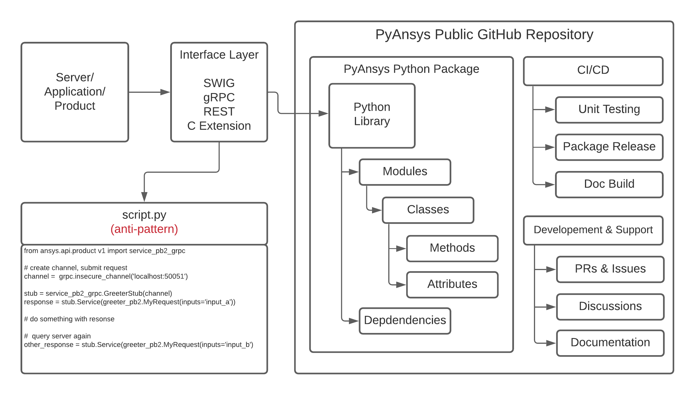

Library Overview
################
A PyAnsys library eliminates the need to share snippets of code that
perform actions. Users can instead create workflows consisting of 
their own Python modules and third-party libraries. This extends 
Ansys's products in a way that matches how libraries are created 
in the Python community while maintaining the separation between 
products, APIs, and PyAnsys client libraries.

To avoid the anti-pattern of providing single-use scripts, the 
general pattern for a PyAnsys library ensures:

* Clear, open-source APIs that are consistent with community standards 
  are hosted on GitHub
* Reusable packages can be updated and patched outside of the
  Ansys release schedule, while still being directly dependent on
  Ansys products
* Unit testing, release packaging, and documentation

This figure shows the general pattern that each PyAnsys library should follow:

The Ansys product or service exposes an interface that is locally
accessible (for example, .NET using `pythoncom`_, `SWIG`_, or `C
extensions`_) or a service that is both locally and remotely
accessible (`REST`_ or `gRPC`_).  This interface is referred to as the
API (Application Programming Interface).  While this API can be
directly accessed, this often results in unreadable and unmaintainable
code that forces users to rewrite setup boilerplate and other methods
from scratch.  Therefore, the best practice is to create a Python layer
that maps the raw API into a carefully designed, object oriented data
model and API.

.. toctree::
   :hidden:
   :maxdepth: 3

   library_structure
   library_names
   repo_directory_structure
   ci_cd
   source_organization
   readme_file
   setup_file
   doc_directory  
   license
   
.. _gRPC: https://grpc.io/
.. _pythoncom: http://timgolden.me.uk/pywin32-docs/pythoncom.html
.. _SWIG: http://www.swig.org/
.. _C extensions: https://docs.python.org/3/extending/extending.html
.. _Anaconda Distribution: https://www.anaconda.com/products/individual
.. _REST: https://en.wikipedia.org/wiki/Representational_state_transfer
.. _PyAEDT: https://github.com/pyansys/PyAEDT
.. _PyMAPDL: https://github.com/pyansys/pymapdl
.. _pymapdl: https://github.com/pyansys/pymapdl
.. _Style Guide for Python Code (PEP8): https://www.python.org/dev/peps/pep-0008
.. _grpc_chunk_stream_demo: https://github.com/pyansys/grpc_chunk_stream_demo
.. _numpydoc: https://numpydoc.readthedocs.io/en/latest/format.html
.. _Namespace Packages: https://packaging.python.org/guides/packaging-namespace-packages/
