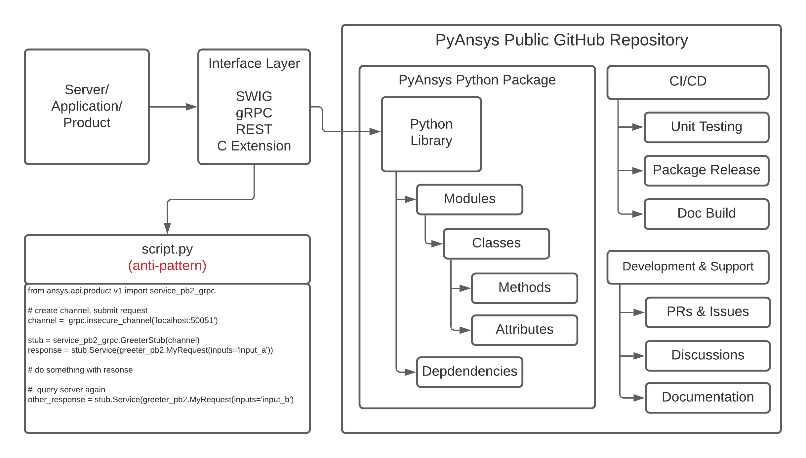

Packaging style
===============

A PyAnsys library eliminates the need to share code snippets for
performing actions. You can instead create workflows consisting of 
Python modules and third-party libraries. This extends Ansys products
in a way that matches how libraries are created in the Python community
while maintaining the separation between products, APIs, and PyAnsys
client libraries.

To avoid the anti-pattern of providing single-use scripts, the 
general pattern for a PyAnsys library provides these features:

* Clear, GitHub-hosted open source APIs that are consistent with community
  standards 
* Reusable packages that can be updated and patched outside of the
  Ansys release schedule, while still being directly dependent on
  Ansys products
* Unit testing, release packaging, and documentation

This diagram shows the general pattern that each PyAnsys library should follow:

The Ansys product or service exposes an interface that is locally
accessible (for example, .NET using `pythoncom`_, `SWIG`_, or `C
extensions`_) or a service that is both locally and remotely
accessible using `REST`_ or `gRPC`_. This interface is referred to as the
API (Application Programming Interface).  While this API can be
directly accessed, this often results in unreadable and unmaintainable
code that forces users to rewrite setup boilerplate and other methods
from scratch. Therefore, the best practice is to create a Python layer
that maps the raw API into a carefully designed, object-oriented data
model and API.

.. toctree::
   :hidden:
   :maxdepth: 3

   templates
   structure
   build-systems
